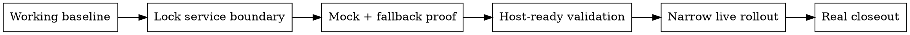

# Mock-First Provider Rollout

## Overview

Bring external providers in through a project-owned boundary, with safe defaults and explicit live gates.

**Core principle:** prove mock and fallback behavior before live behavior.

## When to Use

Use when:
- the product already runs locally or on a target host
- the next step is a real provider rollout
- account approval, credentials, DNS, HTTPS, or dashboard setup are still moving

Do not use when:
- the product is still a fragile prototype
- there is no stable validation path yet
- the real problem is project hardening, not provider rollout

## Hard Gates

- Product code must call a project-owned service interface, not provider SDK globals.
- Committed defaults must stay safe: mock, local, disabled, or equivalent.
- Live provider behavior must be opt-in through explicit config or deploy-time override.
- Mock, deny, timeout, unavailable, and error paths must exist before live closeout.
- First live rollout must be narrow: allowlisted routes, placements, or capabilities only.

## Rollout Order

## Stop Rules

If the blocker is now external, stop pretending more code is the answer.

External blockers include:
- account review
- permission access
- DNS or HTTPS
- provider dashboard setup
- missing real IDs, unit paths, keys, or approvals
- required human sign-in or email confirmation

When that happens:
- write the blocker down
- write the operator note
- record exact next steps
- preserve evidence
- stop widening the rollout

## Quick Reference

| Situation | Correct move |
| --- | --- |
| Live account not ready | Keep mock default, record blocker |
| Provider SDK needed | Add/keep adapter boundary first |
| Demo pressure | Separate demo config from true live closeout |
| First real rollout | Start with explicit allowlist |
| Waiting on external team | Improve fallback or observability, not live coupling |

## Red Flags

- "Just make the real adapter the default for now."
- "We can hardcode a placeholder path and swap it later."
- "This one screen can talk to the SDK directly."
- "Host validation can wait until after integration."
- "While approval is pending, let's keep coding toward live anyway."

## Common Mistakes

- Treating live rollout as normal feature work.
- Confusing "real-looking demo" with real closeout.
- Doing productive-looking code work while failing to elevate blocker tracking.
- Expanding live scope before the first narrow path is proven.
- Letting debug state hide why live mode is unavailable.

## What Good Output Looks Like

- one stable service contract
- one safe committed baseline
- one explicit live override path
- diagnosable adapter/debug state
- a narrow first live scope
- a blocker note and closeout checklist

## What This Skill Is Not

This is not a general refactor or prototype-hardening skill.

If the project itself is still unstable, stop and use a hardening workflow first.
